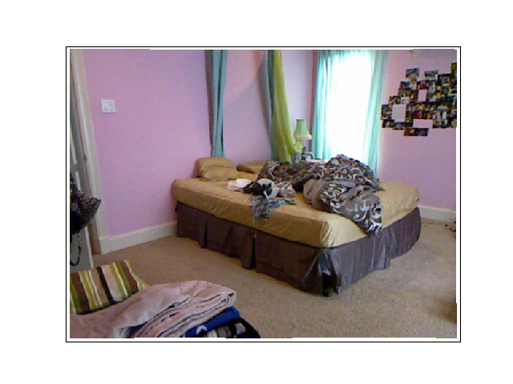
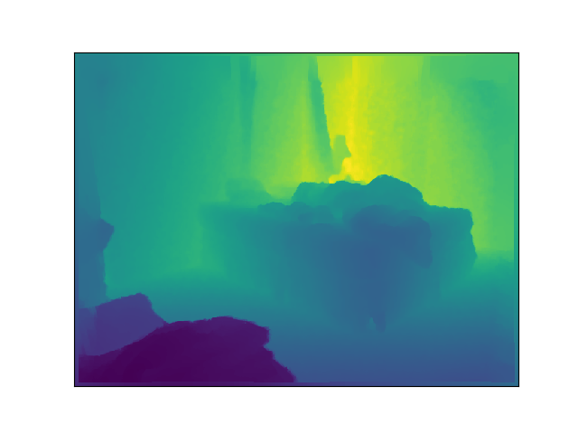
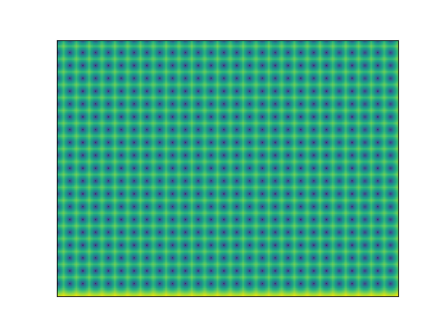
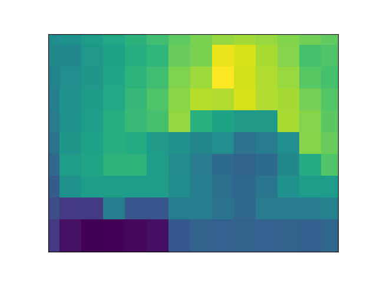
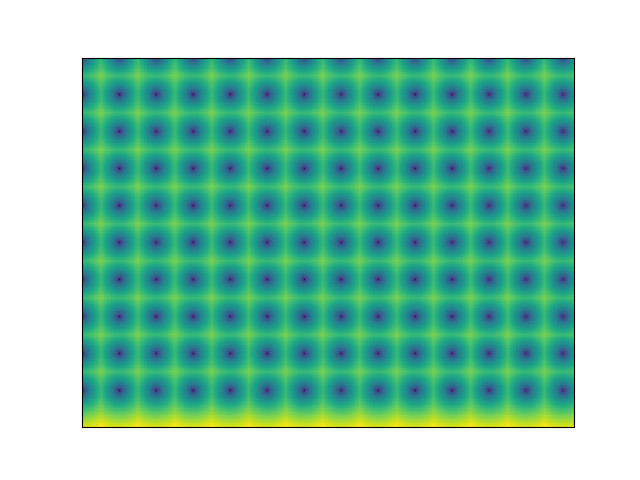

# Estimating Depth from RGB and Sparse Sensing

Paper Link: [arxiv](https://arxiv.org/abs/1804.02771)

# Requirements
- Ubuntu (Tested only on 16.04)
- Python 3
- Chainer
- ChainerCV
- cupy
- [imgplot](https://github.com/musyoku/imgplot/)

# TODO
- [x] Generate sparse inputs
- [ ] Build the network
- [ ] Implement training loop

# Current Progress

  
  

## Downsampling factor of `24x24`

  
  
  

## Downsampling factor of `48x48`

  
  
  

