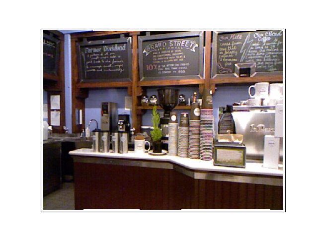
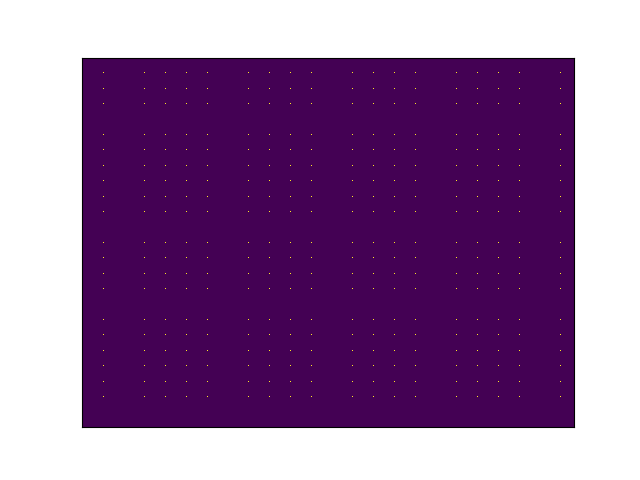
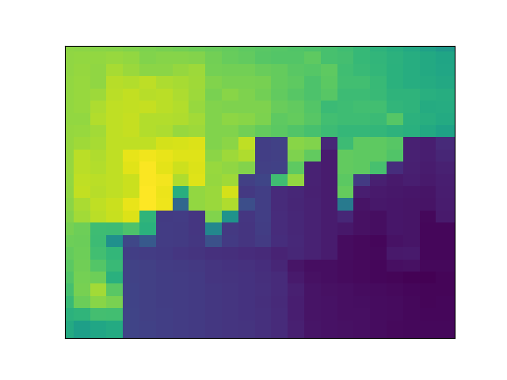
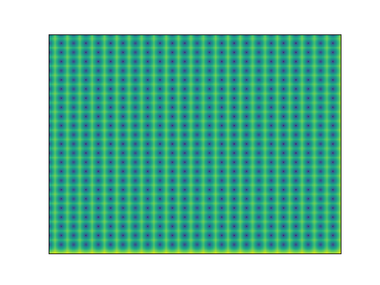
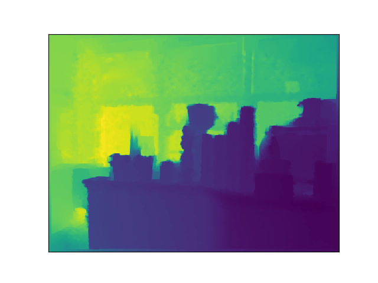
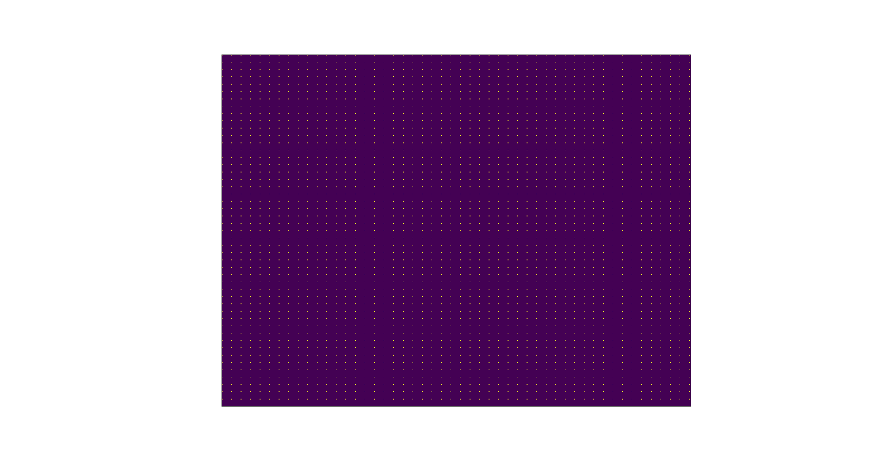
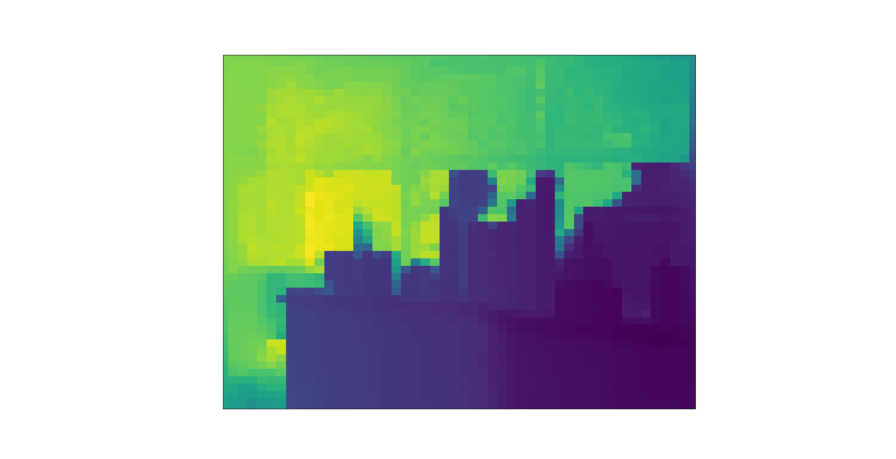
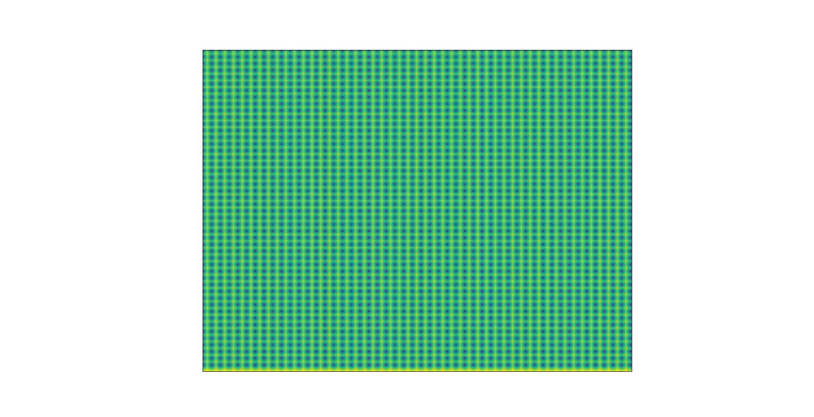

# Estimating Depth from RGB and Sparse Sensing

# Requirements
- Ubuntu (Tested only on 16.04)
- Python 3
- Chainer
- ChainerCV
- cupy
- [imgplot](https://github.com/musyoku/imgplot/)

# TODO
- [x] Generate sparse inputs
- [ ] Build the network
- [ ] Implement training loop

# Current Progress
From left to right, input image, ground truth depth map, depth mask, sparse depth map 1 and sparse depth map 2. \
## Downsampling factor of `24x24`

<div class="fig figcenter fighighlight">
  
  
  
  
  
</div>

## Downsampling factor of `48x48`

<div class="fig figcenter fighighlight">
  
  
  
  
  
</div>


# Usage :construction: WIP :construction:
- Append the path to the root of this directory to `PYTHONPATH` environment variable

```bash
$ export PYTHONPATH=$PYTHONPATH:/path/to/sparse_depth_sensing
```

